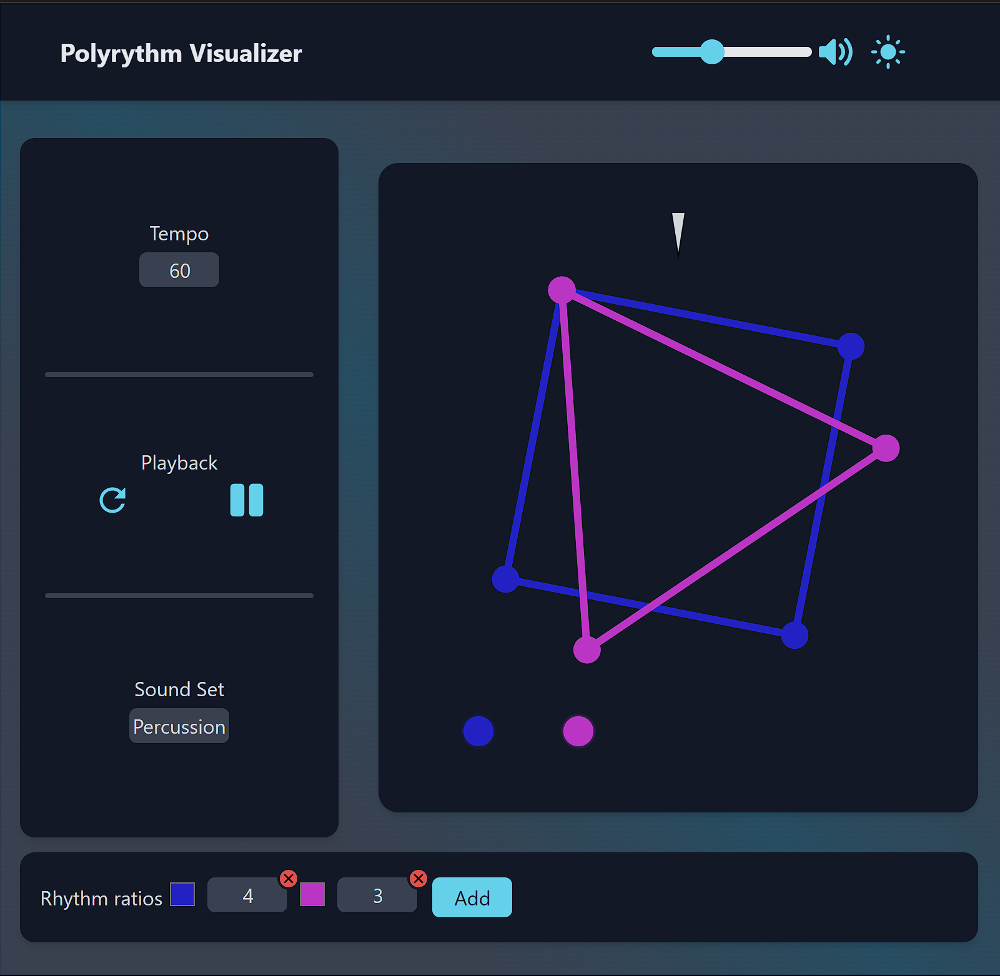

### React app that visualizes polyrhythms 

[heroku build](https://polyrhythm-7923f114ac17.herokuapp.com)



## About
Polyrhythms are rhythms that are not multiples of each other. This app allows you to create and play polyrhythms.
## How to use
You can add up to 5 rhythms. Each rhythm has a number and a color. You can change the number by clicking on it and typing a new number. You can change the color by clicking on the color picker. You can remove a rhythm by clicking on the X button.
## Build
  1. clone repo
  2. ```sh
     npm install
     ```
  3. ```
     npm run dev
     cd backend
     node index.js
     ```
